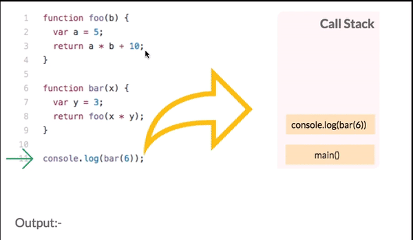

# Read 01 ~ Node Ecosystem, TDD, CI/CD
> By Abdallah obaid

**NAME**     | **URL**
------------ | -------------
Home         | [Home](https://abdallah-401-advanced-javascript.github.io/).
 Prep        | [Prep: Engineering Topics](https://abdallah-401-advanced-javascript.github.io/Prep).
 Read 01     | [Node Ecosystem, TDD, CI/CD](https://abdallah-401-advanced-javascript.github.io/class-01).
 Read 02     | [Classes, Inheritance, Functional](https://abdallah-401-advanced-javascript.github.io/class-02).
 Read 03     | [Data Modeling & NoSQL Databases](https://abdallah-401-advanced-javascript.github.io/class-03).
 Read 04     | [Advanced Mongo/Mongoose](https://abdallah-401-advanced-javascript.github.io/class-04).
 Read 05     | [Linked Lists](https://abdallah-401-advanced-javascript.github.io/class-05).
 Read 06     | [HTTP and REST](https://abdallah-401-advanced-javascript.github.io/class-06).
 Read 07     | [Express](https://abdallah-401-advanced-javascript.github.io/class-07).
 Read 08     | [Express Routing & Connected API](https://abdallah-401-advanced-javascript.github.io/class-08).
 Read 09     | [API Server](https://abdallah-401-advanced-javascript.github.io/class-09).
 Read 10     | [Stacks and Queues](https://abdallah-401-advanced-javascript.github.io/class-10).
 Read 11     | [Authentication](https://abdallah-401-advanced-javascript.github.io/class-11).
 Read 12     | [OAuth](https://abdallah-401-advanced-javascript.github.io/class-12).
 Read 13     | [Bearer Authorization](https://abdallah-401-advanced-javascript.github.io/class-13).
 Read 14     | [Access Control (ACL)](https://abdallah-401-advanced-javascript.github.io/class-14).
 Read 15     | [Trees](https://abdallah-401-advanced-javascript.github.io/class-15).
 Read 16     | [Event Driven Applications](https://abdallah-401-advanced-javascript.github.io/class-16).

 
----------------------------------
# Call stack:-
----------------------------------
 * **A call stack** is a **data structure** that uses the Last In, First Out **(LIFO)** principle to temporarily store and manage function invocation (call).
 * A call stack is a mechanism for an interpreter (like the JavaScript interpreter in a web browser) to keep track of its place in a script that calls multiple functions — what function is currently being run and what functions are called from within that function, etc.
   > When a script calls a function, the interpreter adds it to the call stack and then starts carrying out the function.
   > Any functions that are called by that function are added to the call stack further up, and run where their calls are reached.
   > When the current function is finished, the interpreter takes it off the stack and resumes execution where it left off in the last code listing.
   > If the stack takes up more space than it had assigned to it, it results in a "stack overflow" error.
 
 # JavaScript call stack:-
 ----------------------------------
 * **The JavaScript engine** (which is found in a hosting environment like the browser), is a single-threaded interpreter comprising of a heap and a single call stack. The browser provides web APIs like the DOM, AJAX, and Timers.
 * **Call stack** is single, function(s) execution, is done, one at a time, from top to bottom. It means the call stack is synchronous.
 * **LIFO**: ( Last In, First Out) it means that the last function that gets pushed into the stack is the first to be pop out, when the function returns.
 * When the code is run, we get an error. A stack is printed showing how the functions are stack on top each other.
 * **Temporarily store**: When a function is invoked (called), the function, its parameters, and variables are pushed into the call stack to form a stack frame. This stack frame is a memory location in the stack. The memory is cleared when the function returns as it is pop out of the stack.

 