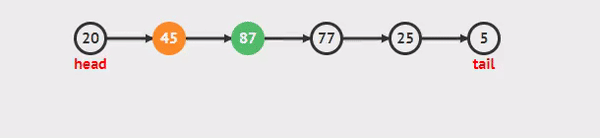

# Read 05 ~ Linked Lists
> By Abdallah obaid

**NAME**     | **URL**
------------ | -------------
Home         | [Home](https://abdallah-401-advanced-javascript.github.io/reading-notes-401/).
 Prep        | [Prep: Engineering Topics](https://abdallah-401-advanced-javascript.github.io/reading-notes-401/Prep).
 Read 01     | [Node Ecosystem, TDD, CI/CD](https://abdallah-401-advanced-javascript.github.io/reading-notes-401/class-01).
 Read 02     | [Classes, Inheritance, Functional](https://abdallah-401-advanced-javascript.github.io/reading-notes-401/class-02).
 Read 03     | [Data Modeling & NoSQL Databases](https://abdallah-401-advanced-javascript.github.io/reading-notes-401/class-03).
 Read 04     | [Advanced Mongo/Mongoose](https://abdallah-401-advanced-javascript.github.io/reading-notes-401/class-04).
 Read 05     | [Linked Lists](https://abdallah-401-advanced-javascript.github.io/reading-notes-401/class-05).
 Read 06     | [HTTP and REST](https://abdallah-401-advanced-javascript.github.io/reading-notes-401/class-06).
 Read 07     | [Express](https://abdallah-401-advanced-javascript.github.io/reading-notes-401/class-07).
 Read 08     | [Express Routing & Connected API](https://abdallah-401-advanced-javascript.github.io/reading-notes-401/class-08).
 Read 09     | [API Server](https://abdallah-401-advanced-javascript.github.io/reading-notes-401/class-09).
 Read 10     | [Stacks and Queues](https://abdallah-401-advanced-javascript.github.io/reading-notes-401/class-10).
 Read 11     | [Authentication](https://abdallah-401-advanced-javascript.github.io/reading-notes-401/class-11).
 Read 12     | [OAuth](https://abdallah-401-advanced-javascript.github.io/reading-notes-401/class-12).
 Read 13     | [Bearer Authorization](https://abdallah-401-advanced-javascript.github.io/reading-notes-401/class-13).
 Read 14     | [Access Control (ACL)](https://abdallah-401-advanced-javascript.github.io/reading-notes-401/class-14).
 Read 15     | [Trees](https://abdallah-401-advanced-javascript.github.io/reading-notes-401/class-15).
 Read 16     | [Event Driven Applications](https://abdallah-401-advanced-javascript.github.io/reading-notes-401/class-16).

 
----------------------------------
# Linked Lists:-
----------------------------------

 ## linked list: 
 * **linked list** consists of nodes where each node contains a data field and a reference(link) to the next node in the list.
 * The linked list could be **singly** or **doubly** node reference.
 * **Singly** linked list when the node just refers to the next node.
 * **Doubly** linked list when the node refers to the next and previous node.
 * The **Next** is a property in each node that contains the reference for the next node.
 * The **Current** reference is a reference type of type Node that is currently being looked at.
 * The **Head** is a reference type of type Node to the first node in a linked list.
 * We are not able to use a **foreach** or for **loop**. We depend on the **Next** value in each node to guide us where the next reference is pointing.
 * `while()` loop Allows us to continually check that the Next node in the list is not null.
 
 ## In the Linked Lists we can use:
 1. Includes.
 2. Adding (O(1)/middle).
 3. Print Out Nodes.

 
 