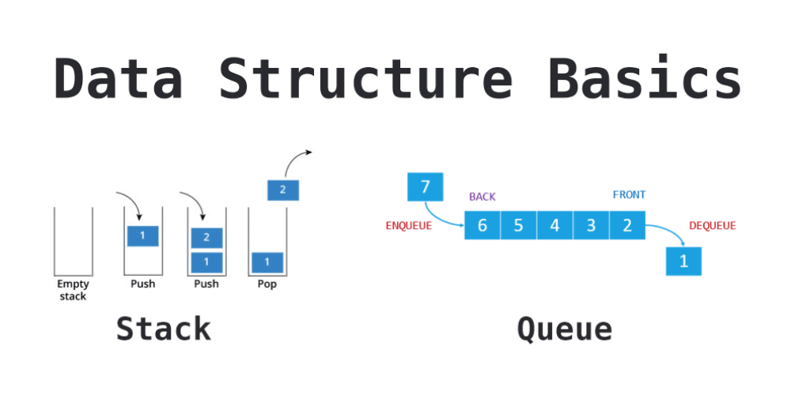

# Read 10 ~ Stacks & Queues
> By Abdallah obaid

**NAME**     | **URL**
------------ | -------------
Home         | [Home](https://abdallah-401-advanced-javascript.github.io/reading-notes-401/).
 Prep        | [Prep: Engineering Topics](https://abdallah-401-advanced-javascript.github.io/reading-notes-401/Prep).
 Read 01     | [Node Ecosystem, TDD, CI/CD](https://abdallah-401-advanced-javascript.github.io/reading-notes-401/class-01).
 Read 02     | [Classes, Inheritance, Functional](https://abdallah-401-advanced-javascript.github.io/reading-notes-401/class-02).
 Read 03     | [Data Modeling & NoSQL Databases](https://abdallah-401-advanced-javascript.github.io/reading-notes-401/class-03).
 Read 04     | [Advanced Mongo/Mongoose](https://abdallah-401-advanced-javascript.github.io/reading-notes-401/class-04).
 Read 05     | [Linked Lists](https://abdallah-401-advanced-javascript.github.io/reading-notes-401/class-05).
 Read 06     | [HTTP and REST](https://abdallah-401-advanced-javascript.github.io/reading-notes-401/class-06).
 Read 07     | [Express](https://abdallah-401-advanced-javascript.github.io/reading-notes-401/class-07).
 Read 08     | [Express Routing & Connected API](https://abdallah-401-advanced-javascript.github.io/reading-notes-401/class-08).
 Read 09     | [API Server](https://abdallah-401-advanced-javascript.github.io/reading-notes-401/class-09).
 Read 10     | [Stacks and Queues](https://abdallah-401-advanced-javascript.github.io/reading-notes-401/class-10).
 Read 11     | [Authentication](https://abdallah-401-advanced-javascript.github.io/reading-notes-401/class-11).
 Read 12     | [OAuth](https://abdallah-401-advanced-javascript.github.io/reading-notes-401/class-12).
 Read 13     | [Bearer Authorization](https://abdallah-401-advanced-javascript.github.io/reading-notes-401/class-13).
 Read 14     | [Access Control (ACL)](https://abdallah-401-advanced-javascript.github.io/reading-notes-401/class-14).
 Read 15     | [Trees](https://abdallah-401-advanced-javascript.github.io/reading-notes-401/class-15).
 Read 16     | [Event Driven Applications](https://abdallah-401-advanced-javascript.github.io/reading-notes-401/class-16).

 
----------------------------------
# Stacks & Queues
----------------------------------
 ## Stacks:
 * Stack is a linear data structure, consists of Nodes. Each Node references the next Node, but does not refer to previous node.
 * Stack follows a particular order in which the operations are performed. The order may be LIFO(Last In First Out) or FILO(First In Last Out).
 * **Common terminology for a stack is:**
 1. **Push**: to add node. 
 2. **Pop**: remove node || if empty return exception.
 3. **Top**: top of the stack. 
 4. **Peek**: used to view the top || if empty return exception.
 5. **IsEmpty**: returns true when stack is empty otherwise returns false.
 * When you **push** something to the stack, it becomes the new **top**.
 * **Pop** remove Node from the **top**.
 * The Big O for bush is O(1), it takes the same amount of time no matter how many Nodes (n) 
 * When we try to use **pop** we should check before if the stack empty or not with **isEmpty**.
 * **Peek** can just check for the **top** node.
 * With **peek** we need also to check if stack **isEmpty** to avoid the exception.

 ## Queue:
 * Its also a particular order in which the operations are performed. The order may be LIFO(Last In First Out) or FILO(First In Last Out).
 * **Common terminology for a queue is:**
 1. **Enqueue**: Nodes or items that are added to the queue.
 2. **Dequeue**: Nodes or items that are removed from the queue. If called when the queue is empty an exception will be raised.
 3. **Front**: This is the front/first Node of the queue.
 4. **Rear**: This is the rear/last Node of the queue.
 5. **Peek**: When you peek you will view the **value** of the front Node in the queue. If called when the queue is empty an **exception** will be raised.
 6. **IsEmpty**: returns true when queue is empty otherwise returns false.
  
 