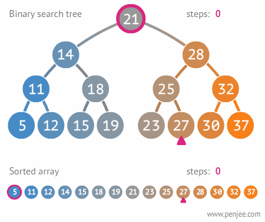

# Read 15 ~ Trees
> By Abdallah obaid

**NAME**     | **URL**
------------ | -------------
Home         | [Home](https://abdallah-401-advanced-javascript.github.io/reading-notes-401/).
 Prep        | [Prep: Engineering Topics](https://abdallah-401-advanced-javascript.github.io/reading-notes-401/Prep).
 Read 01     | [Node Ecosystem, TDD, CI/CD](https://abdallah-401-advanced-javascript.github.io/reading-notes-401/class-01).
 Read 02     | [Classes, Inheritance, Functional](https://abdallah-401-advanced-javascript.github.io/reading-notes-401/class-02).
 Read 03     | [Data Modeling & NoSQL Databases](https://abdallah-401-advanced-javascript.github.io/reading-notes-401/class-03).
 Read 04     | [Advanced Mongo/Mongoose](https://abdallah-401-advanced-javascript.github.io/reading-notes-401/class-04).
 Read 05     | [Linked Lists](https://abdallah-401-advanced-javascript.github.io/reading-notes-401/class-05).
 Read 06     | [HTTP and REST](https://abdallah-401-advanced-javascript.github.io/reading-notes-401/class-06).
 Read 07     | [Express](https://abdallah-401-advanced-javascript.github.io/reading-notes-401/class-07).
 Read 08     | [Express Routing & Connected API](https://abdallah-401-advanced-javascript.github.io/reading-notes-401/class-08).
 Read 09     | [API Server](https://abdallah-401-advanced-javascript.github.io/reading-notes-401/class-09).
 Read 10     | [Stacks and Queues](https://abdallah-401-advanced-javascript.github.io/reading-notes-401/class-10).
 Read 11     | [Authentication](https://abdallah-401-advanced-javascript.github.io/reading-notes-401/class-11).
 Read 12     | [OAuth](https://abdallah-401-advanced-javascript.github.io/reading-notes-401/class-12).
 Read 13     | [Bearer Authorization](https://abdallah-401-advanced-javascript.github.io/reading-notes-401/class-13).
 Read 14     | [Access Control (ACL)](https://abdallah-401-advanced-javascript.github.io/reading-notes-401/class-14).
 Read 15     | [Trees](https://abdallah-401-advanced-javascript.github.io/reading-notes-401/class-15).
 Read 16     | [Event Driven Applications](https://abdallah-401-advanced-javascript.github.io/reading-notes-401/class-16).

 
----------------------------------
# Trees
----------------------------------
 ## Trees:
 * A tree data structure can be defined recursively as a collection of nodes (starting at a root node), where each node is a data structure consisting of a value, together with a list of references to nodes (the "children"), with the constraints that no reference is duplicated, and none points to the root.
 * Trees are good for reducing the search time for an element within the container.
 * **Tree**: could be traversals by: **Depth First** | **Breadth First**.
 * **Depth-first** divided into three different methods:
 1. Pre-order: root >> left >> right
 2. In-order: left >> root >> right
 3. Post-order: left >> right >> root
 * **Breadth-first** traversal iterates through the tree by going through each level of the tree **node-by-node**. So, given our starting tree one more time.

 ## Common Tree Terminology:
  * Node - individual **item/data** that makes up the data structure.
  * Root - the **first/top** Node in the tree.
  * Left Child - The node in the left of a root or node.
  * Right Child - The node in the right of a root or  node.
  * Edge - link between a **parent** and **child** node.
  * Leaf - **node** that **does not** contain any **children**.
  * Height - number of edges from the **root** to the **bottommost** node
 
 ## Binary Tree Data Structure :
 * A tree whose elements have at most 2 children is called a binary tree. Since each element in a binary tree can have only 2 children, we typically name them the left and right child.

  ## Role-based access control (RBAC):
  * **Role-based access control (RBAC)** is a method of restricting network access based on the roles of individual users within an enterprise. 
  * **RBAC** lets employees have access rights only to the information they need to do their jobs.
  * **RBAC** Allows us to use polices so if employees change then we just need to change his yours.

 
 