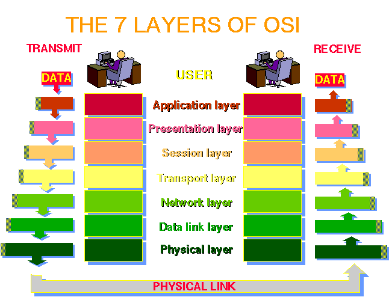

# Read 17 ~ TCP Servers
> By Abdallah obaid

**NAME**     | **URL**
------------ | -------------
Home         | [Home](https://abdallah-401-advanced-javascript.github.io/reading-notes-401/).
 Prep        | [Prep: Engineering Topics](https://abdallah-401-advanced-javascript.github.io/reading-notes-401/Prep).
 Read 01     | [Node Ecosystem, TDD, CI/CD](https://abdallah-401-advanced-javascript.github.io/reading-notes-401/class-01).
 Read 02     | [Classes, Inheritance, Functional](https://abdallah-401-advanced-javascript.github.io/reading-notes-401/class-02).
 Read 03     | [Data Modeling & NoSQL Databases](https://abdallah-401-advanced-javascript.github.io/reading-notes-401/class-03).
 Read 04     | [Advanced Mongo/Mongoose](https://abdallah-401-advanced-javascript.github.io/reading-notes-401/class-04).
 Read 05     | [Linked Lists](https://abdallah-401-advanced-javascript.github.io/reading-notes-401/class-05).
 Read 06     | [HTTP and REST](https://abdallah-401-advanced-javascript.github.io/reading-notes-401/class-06).
 Read 07     | [Express](https://abdallah-401-advanced-javascript.github.io/reading-notes-401/class-07).
 Read 08     | [Express Routing & Connected API](https://abdallah-401-advanced-javascript.github.io/reading-notes-401/class-08).
 Read 09     | [API Server](https://abdallah-401-advanced-javascript.github.io/reading-notes-401/class-09).
 Read 10     | [Stacks and Queues](https://abdallah-401-advanced-javascript.github.io/reading-notes-401/class-10).
 Read 11     | [Authentication](https://abdallah-401-advanced-javascript.github.io/reading-notes-401/class-11).
 Read 12     | [OAuth](https://abdallah-401-advanced-javascript.github.io/reading-notes-401/class-12).
 Read 13     | [Bearer Authorization](https://abdallah-401-advanced-javascript.github.io/reading-notes-401/class-13).
 Read 14     | [Access Control (ACL)](https://abdallah-401-advanced-javascript.github.io/reading-notes-401/class-14).
 Read 15     | [Trees](https://abdallah-401-advanced-javascript.github.io/reading-notes-401/class-15).
 Read 16     | [Event Driven Applications](https://abdallah-401-advanced-javascript.github.io/reading-notes-401/class-16).
 Read 17     | [Event Driven Applications](https://abdallah-401-advanced-javascript.github.io/reading-notes-401/class-17). 

 
----------------------------------
# TCP Servers
----------------------------------

 ## Event Queues:
  * Node.js built around the use of events. 
  * **Queue** here is a central general "Hub" server, that receives all inbound messages, scrubs the content,.
  

 ## OSI Model:
 * **OSI Model** or the **Open Systems Interconnection model** is a is a conceptual model that characterises and standardises the communication functions of a telecommunication or computing system without regard to its underlying internal structure and technology.
 * **OSI Model** developed in 1980 as a seven layer model.
 * The seven layer's are: 1.Physical 2.Data Link 3.Network 4.Transport 5.Session 6.Presentation 7.Application

 ## Internet Protocol Suite:
 * Its a conceptual model for the protocols used by the internet.
 * IP and TCP were the original protocols in the suite, so we often referred to it as TCP/IP.
 * The Internet Protocol Suite is described using four layers: 1.Link 2.Internet 3.Transport 4.Application

 
 