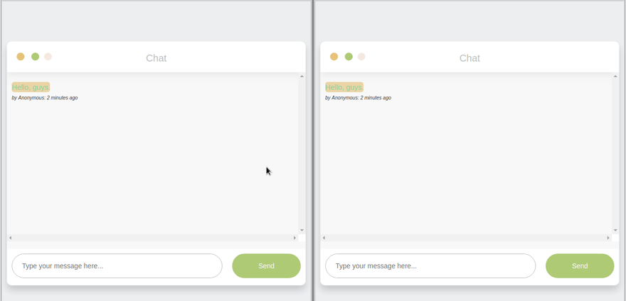

# Read 18 ~ Socket.io
> By Abdallah obaid

**NAME**     | **URL**
------------ | -------------
Home         | [Home](https://abdallah-401-advanced-javascript.github.io/reading-notes-401/).
 Prep        | [Prep: Engineering Topics](https://abdallah-401-advanced-javascript.github.io/reading-notes-401/Prep).
 Read 01     | [Node Ecosystem, TDD, CI/CD](https://abdallah-401-advanced-javascript.github.io/reading-notes-401/class-01).
 Read 02     | [Classes, Inheritance, Functional](https://abdallah-401-advanced-javascript.github.io/reading-notes-401/class-02).
 Read 03     | [Data Modeling & NoSQL Databases](https://abdallah-401-advanced-javascript.github.io/reading-notes-401/class-03).
 Read 04     | [Advanced Mongo/Mongoose](https://abdallah-401-advanced-javascript.github.io/reading-notes-401/class-04).
 Read 05     | [Linked Lists](https://abdallah-401-advanced-javascript.github.io/reading-notes-401/class-05).
 Read 06     | [HTTP and REST](https://abdallah-401-advanced-javascript.github.io/reading-notes-401/class-06).
 Read 07     | [Express](https://abdallah-401-advanced-javascript.github.io/reading-notes-401/class-07).
 Read 08     | [Express Routing & Connected API](https://abdallah-401-advanced-javascript.github.io/reading-notes-401/class-08).
 Read 09     | [API Server](https://abdallah-401-advanced-javascript.github.io/reading-notes-401/class-09).
 Read 10     | [Stacks and Queues](https://abdallah-401-advanced-javascript.github.io/reading-notes-401/class-10).
 Read 11     | [Authentication](https://abdallah-401-advanced-javascript.github.io/reading-notes-401/class-11).
 Read 12     | [OAuth](https://abdallah-401-advanced-javascript.github.io/reading-notes-401/class-12).
 Read 13     | [Bearer Authorization](https://abdallah-401-advanced-javascript.github.io/reading-notes-401/class-13).
 Read 14     | [Access Control (ACL)](https://abdallah-401-advanced-javascript.github.io/reading-notes-401/class-14).
 Read 15     | [Trees](https://abdallah-401-advanced-javascript.github.io/reading-notes-401/class-15).
 Read 16     | [Event Driven Applications](https://abdallah-401-advanced-javascript.github.io/reading-notes-401/class-16).
 Read 17     | [TCP Servers](https://abdallah-401-advanced-javascript.github.io/reading-notes-401/class-17). 
 Read 18     | [Socket.io](https://abdallah-401-advanced-javascript.github.io/reading-notes-401/class-18).
 
----------------------------------
# Socket.io
----------------------------------

 ## WebSocket:
  * Its a **communication Protocol**. 
  * **WebSocket** allow the **real-time** data transfer.
  * **WebSocket** provides **bidirectional** communication between the **Client** and the **Server** over a **TCP connection**.
  * There will be a connection between client and server, the connection will not break after the server returned a response until the client or server do that.
  
 ## Socket.io:
  * It's a **library**.
  * It's wrork a **webSocket Protocol**.
  * It's divided into two parts:
     1. Client Side: it is the library that runs inside the browser.
     2. Server Side: It is the library for Node.js.
  * It's contain additional functionality:
     1. Broadcasting.
     2. Namespacing.
     3. Means of segmenting connected clients into groups.
 ##  difference between Socket.io and TCP connections:
  * With **TCP**, you connect directly to a **server** with a keep-alive type of connection.
  * With **Socket.io**, you connect to a server over **HTTP**. The session is “kept alive” through it’s internal use of the WebSocket Protocol, with session information being preserved.
  * **Socket.io** events are sent with **emit()** and received with **on()**, events shared between ‘disconnected’ participants. Through a mediator (server), clients connect, emit events, and respond to events from the server.

 