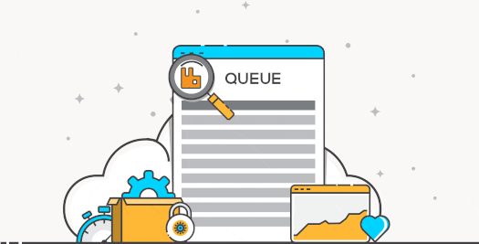

# Read 19 ~ Message Queues
> By Abdallah obaid

**NAME**     | **URL**
------------ | -------------
Home         | [Home](https://abdallah-401-advanced-javascript.github.io/reading-notes-401/).
 Prep        | [Prep: Engineering Topics](https://abdallah-401-advanced-javascript.github.io/reading-notes-401/Prep).
 Read 01     | [Node Ecosystem, TDD, CI/CD](https://abdallah-401-advanced-javascript.github.io/reading-notes-401/class-01).
 Read 02     | [Classes, Inheritance, Functional](https://abdallah-401-advanced-javascript.github.io/reading-notes-401/class-02).
 Read 03     | [Data Modeling & NoSQL Databases](https://abdallah-401-advanced-javascript.github.io/reading-notes-401/class-03).
 Read 04     | [Advanced Mongo/Mongoose](https://abdallah-401-advanced-javascript.github.io/reading-notes-401/class-04).
 Read 05     | [Linked Lists](https://abdallah-401-advanced-javascript.github.io/reading-notes-401/class-05).
 Read 06     | [HTTP and REST](https://abdallah-401-advanced-javascript.github.io/reading-notes-401/class-06).
 Read 07     | [Express](https://abdallah-401-advanced-javascript.github.io/reading-notes-401/class-07).
 Read 08     | [Express Routing & Connected API](https://abdallah-401-advanced-javascript.github.io/reading-notes-401/class-08).
 Read 09     | [API Server](https://abdallah-401-advanced-javascript.github.io/reading-notes-401/class-09).
 Read 10     | [Stacks and Queues](https://abdallah-401-advanced-javascript.github.io/reading-notes-401/class-10).
 Read 11     | [Authentication](https://abdallah-401-advanced-javascript.github.io/reading-notes-401/class-11).
 Read 12     | [OAuth](https://abdallah-401-advanced-javascript.github.io/reading-notes-401/class-12).
 Read 13     | [Bearer Authorization](https://abdallah-401-advanced-javascript.github.io/reading-notes-401/class-13).
 Read 14     | [Access Control (ACL)](https://abdallah-401-advanced-javascript.github.io/reading-notes-401/class-14).
 Read 15     | [Trees](https://abdallah-401-advanced-javascript.github.io/reading-notes-401/class-15).
 Read 16     | [Event Driven Applications](https://abdallah-401-advanced-javascript.github.io/reading-notes-401/class-16).
 Read 17     | [TCP Servers](https://abdallah-401-advanced-javascript.github.io/reading-notes-401/class-17). 
 Read 18     | [Socket.io](https://abdallah-401-advanced-javascript.github.io/reading-notes-401/class-18).
 Read 19     | [Message Queues](https://abdallah-401-advanced-javascript.github.io/reading-notes-401/class-19).
 
----------------------------------
# Message Queues
----------------------------------

 ## Message Queues:
  * We use it to routing events and messaging between clients. 
  * A **Message Queue** is a form of asynchronous service-to-service communication used in serverless and microservices architectures. Messages are stored on the queue until they are processed and deleted. Each message is processed only once, by a single consumer.
  * **Queue server** receive any published message and then distributing it out to all connected and subscribed clients.
  * **Queue server** must catch the subscribed messages so the client can return it back when needed.

 ## Real Time vs Queued Messaging:
  * In **Real Time** messaging systems If the subscriber client loses connection with the server, any messages broadcast by the server will clearly be missed by the client.
  * **Queue** will keep track of the delivery status of every event/message.
  * Any broadcast that is not received by a subscriber will remain “in the queue” until it can be delivered
  * Rather than a broadcasting of messages, clients will likely **poll**the server to retrieve any messages “in the queue” for them, on their own timeline/schedule.

 