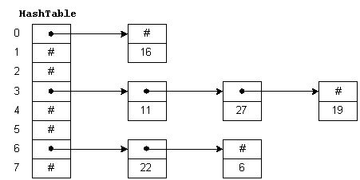

# Read 30 ~ Hash Tables
> By Abdallah obaid

**NAME**     | **URL**
------------ | -------------
Home         | [Home](https://abdallah-401-advanced-javascript.github.io/reading-notes-401/).
 Prep        | [Prep: Engineering Topics](https://abdallah-401-advanced-javascript.github.io/reading-notes-401/Prep).
 Read 01     | [Node Ecosystem, TDD, CI/CD](https://abdallah-401-advanced-javascript.github.io/reading-notes-401/class-01).
 Read 02     | [Classes, Inheritance, Functional](https://abdallah-401-advanced-javascript.github.io/reading-notes-401/class-02).
 Read 03     | [Data Modeling & NoSQL Databases](https://abdallah-401-advanced-javascript.github.io/reading-notes-401/class-03).
 Read 04     | [Advanced Mongo/Mongoose](https://abdallah-401-advanced-javascript.github.io/reading-notes-401/class-04).
 Read 05     | [Linked Lists](https://abdallah-401-advanced-javascript.github.io/reading-notes-401/class-05).
 Read 06     | [HTTP and REST](https://abdallah-401-advanced-javascript.github.io/reading-notes-401/class-06).
 Read 07     | [Express](https://abdallah-401-advanced-javascript.github.io/reading-notes-401/class-07).
 Read 08     | [Express Routing & Connected API](https://abdallah-401-advanced-javascript.github.io/reading-notes-401/class-08).
 Read 09     | [API Server](https://abdallah-401-advanced-javascript.github.io/reading-notes-401/class-09).
 Read 10     | [Stacks and Queues](https://abdallah-401-advanced-javascript.github.io/reading-notes-401/class-10).
 Read 11     | [Authentication](https://abdallah-401-advanced-javascript.github.io/reading-notes-401/class-11).
 Read 12     | [OAuth](https://abdallah-401-advanced-javascript.github.io/reading-notes-401/class-12).
 Read 13     | [Bearer Authorization](https://abdallah-401-advanced-javascript.github.io/reading-notes-401/class-13).
 Read 14     | [Access Control (ACL)](https://abdallah-401-advanced-javascript.github.io/reading-notes-401/class-14).
 Read 15     | [Trees](https://abdallah-401-advanced-javascript.github.io/reading-notes-401/class-15).
 Read 16     | [Event Driven Applications](https://abdallah-401-advanced-javascript.github.io/reading-notes-401/class-16).
 Read 17     | [TCP Servers](https://abdallah-401-advanced-javascript.github.io/reading-notes-401/class-17). 
 Read 18     | [Socket.io](https://abdallah-401-advanced-javascript.github.io/reading-notes-401/class-18).
 Read 19     | [Message Queues](https://abdallah-401-advanced-javascript.github.io/reading-notes-401/class-19).
 Read 26     | [Component Based UI](https://abdallah-401-advanced-javascript.github.io/reading-notes-401/class-26). 
 Read 27     | [React Testing and Deployment](https://abdallah-401-advanced-javascript.github.io/reading-notes-401/class-27).  
 Read 28     | [Props and State](https://abdallah-401-advanced-javascript.github.io/reading-notes-401/class-28). 
 Read 29     | [Component Composition](https://abdallah-401-advanced-javascript.github.io/reading-notes-401/class-29).
 Read 30     | [Hash Tables](https://abdallah-401-advanced-javascript.github.io/reading-notes-401/class-30).

----------------------------------
# Hash Tables
----------------------------------

 ## Hash Tables:
  * We use **Hash Tables** to: Hold unique values- Dictionary- Library.
  * **Hash Table** is a data structure which stores data in an associative manner. In a hash table, data is stored in an array format, where each data value has its own unique index value. Access of data becomes very fast if we know the index of the desired data.
  * **Hash Tables** is quickly why to retrieve the stored value depends on the key(index).
  * **Hash** A hash is the ability to encode the key that will eventually map to a specific location in the data structure that we can look at directly to retrieve the value.its also the result of some algorithm taking an incoming string and converting it into a value that could be used for either security or some other purpose. In the case of a hashtable, it is used to determine the index of the array.
  * **Buckets** A bucket is what is contained in each index of the array of the hashtable. Each index is a bucket. An index could potentially contain multiple key/value pairs if a collision occurs.
  * **Collisions** A collision is what happens when more than one key gets hashed to the same location of the hashtable.
  * In **Hash Table** we can do a lookup in an **O(1)** time complexity. This is ideal when quick lookups are required.

 